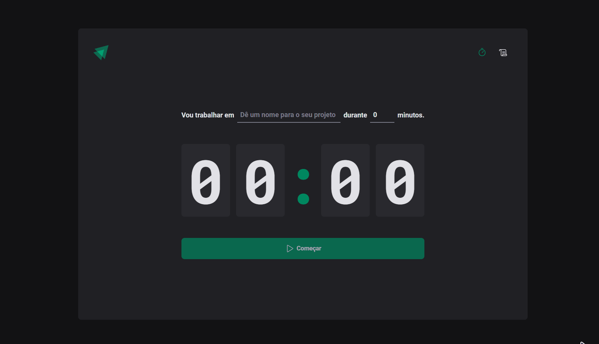

# ignite-timer<h1 align=center>
  ⏰ Ignite Timer ⏰
</h2>

<h3 align=center>
  Cronometrar suas tarefas ficou mais fácil.
</h3>

<h2>Preview do projeto 🚀</h2>

<div align=center>
  
</div>

<h2>Sobre 🕵️</h2>

<p>O Ignite Timer nada mais é que um projeto que permite ao usuário cronometrar as suas tarefas no dia a dia, além de permitir ver um histórico de todos as tarefas já realizadas.<p>

<h2>Tecnologias utilizadas 🤯</h2>

<ul>
  <li><a target="_blank" href="https://vitejs.dev/">Vite</a></li>
  <li><a target="_blank" href="https://react.dev/">React.JS</a></li>
  <li><a target="_blank" href="https://www.typescriptlang.org/">TypeScript</a></li>
  <li><a target="_blank" href="https://styled-components.com/docs/basics">Styled-components</a></li>
  <li><a target="_blank" href="https://react-hook-form.com/">React Hook Form</a></li>
  <li><a target="_blank" href="https://github.com/colinhacks/zod">Zod</a></li>
  <li><a target="_blank" href="https://reactrouter.com/en/v6.3.0/getting-started/overview">React Router</a></li>
  <li><a target="_blank" href="https://github.com/immerjs/immer">Immer</a></li>
  <li><a target="_blank" href="https://date-fns.org/docs/Getting-Started">date-fns</a></li>
</ul>

<h2>Requisitos de software 🔍</h2>

<li><a href="https://git-scm.com">Git</a></li>
<li><a href="https://nodejs.org/en">Node.js</a></li>
<li><a href="https://yarnpkg.com/">Yarn</a> ou <a href="https://www.npmjs.com/">NPM</a></li>

<p>Para rodar o projeto, basta executar os seguintes comandos, em seu terminal com git</p>

```bash
  # Faça um clone do repositório
  git clone <link-do-repositório>

  # Navegue até a pasta do projeto e baixe as dependências
  cd ignite-timer && yarn

  # Executar o projeto
  yarn dev
```
<p>Após esses passos, irá abrir uma página no seu navegador para visualizar o projeto rodando no seu navegador.</p>

<h2>Como contribuir? 😍</h2>

<p>Além de marcar o repositório com uma ⭐, para aumentar sua visibilidade, você pode fazer um fork do projeto, executar os passos anteriores.</p>

```bash
# Dentro da pasta do seu fork, crie uma branch para fazer as alterações

git checkout -b <sua-branch>

# Faça suas alterações
# ...

# Faça um commit do que foi feito

git add .
git commit -m 'conte o que você fez'

# Faça o push do que foi feito

git push origin <sua-branch>
```

<h2>📝 Licença</h2>
Esse projeto se encontra sob a licença <strong>MIT</strong>. Para mais informações, acesse o arquivo <strong>LICENSE</strong>.

<hr>
<p align=center>Made with 💜 by <a target="_blank" href="https://www.linkedin.com/in/leonardo-jorge-a88a561b6">Leonardo Jorge</a><p>
